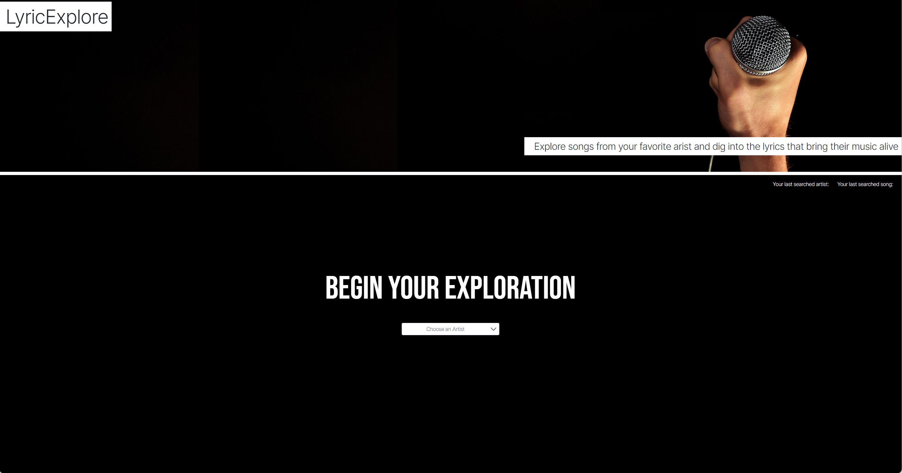

# LyricExplore

## Description

This website offers users a way to look at all of the songs from their favorite arist and view the associated lyrics. Our site lets users select from a list of artists, displays the song list, and shows the lyrics. Their last searched artist and song are displayed on the upper part of the page for reference.

## Installation

Copy project from GitHub repo files here, https://github.com/nikinak/Movie-Song-Recommendations.git, and upload them to a production server of your choice.

## Usage
The user first selects an artist from the dropdown box. Once selected a card appears with a list of songs from that artist. The user can then select a song and the lyrics will appear in a card to the right. 

The user the can refresh or close their browser and their last searched artist and song will be displayed below the header for refernece. This artist and song will chnage as the user continues to search for new music.

Screenshot is just for referance purposes, desktop version below.

Screenshot:

## Deployed Site Link

- https://nikinak.github.io/Movie-Song-Recommendations/

## GitHub Link

- https://github.com/nikinak/Movie-Song-Recommendations

## Credits
### Team Members

- Nicole Kurre
- Alex Hsieh
- Caryn Bo James
- Gabriel Rodriguez

## License
See included MIT license for more information.